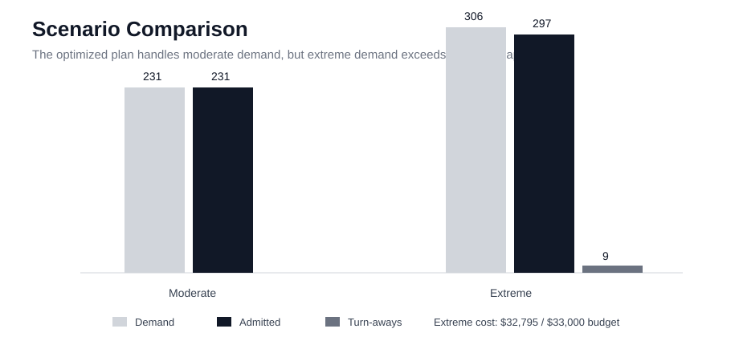
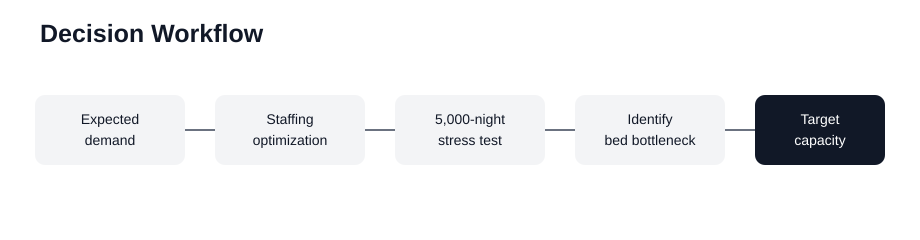
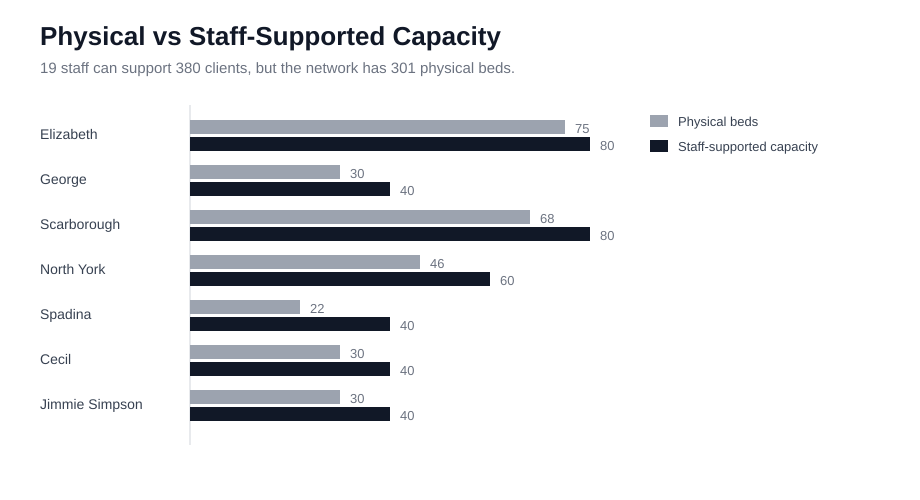

# Toronto Warming Centre Capacity and Staffing Optimization

> **How should limited staffing and bed capacity be allocated across Toronto warming centres when winter demand is uncertain?**

**Python · Monte Carlo Simulation · Integer Optimization · Decision Analytics**

This project models a nightly resource-allocation problem across seven Toronto warming centres. The goal is to reduce unmet demand while staying within a **$33,000 operating budget** and respecting staffing and physical-capacity constraints.

## Results at a glance

**7 centres · 19 staff · 301 physical beds · 5,000-night stress test**

- The optimized staffing plan supports up to **380 clients**, but the network contains only **301 physical beds**.
- Under the moderate planning scenario, **231 of 231** clients are admitted.
- Under the extreme scenario, demand rises to **306** and **297** clients are admitted, leaving **9 turn-aways**.
- Extreme-scenario operating cost is **$32,795**, just below the **$33,000** nightly budget.
- Once staffing is sufficient, the binding operational constraint shifts toward **physical bed capacity**.

<p align="center"></p>

## Business decision

The main insight is not simply how many staff to schedule. The model shows that adding labour eventually stops creating additional usable capacity because beds become the tighter constraint.

That changes the operational question from:

**“How many more staff do we need?”**

to:

**“Where would additional physical capacity reduce unmet demand most effectively?”**

The original expansion analysis therefore compared different ways to allocate **10 additional beds**. The targeted configuration placed **5 beds at Elizabeth and 5 at Scarborough** and was reported to improve welfare by **5.7%** while reducing turn-aways by **67%** relative to the comparison setting used in the original analysis.

These figures are scenario-based model results rather than forecasts of real shelter outcomes.

<p align="center"></p>

## Capacity bottleneck

The optimization allocates **19 staff** across the seven centres. At a **1:20 staff-to-client ratio**, that staffing level can theoretically support 380 clients, while the network contains 301 physical beds.

| Centre | Staff | Physical Capacity | Staff-Supported Capacity |
|---|---:|---:|---:|
| Elizabeth | 4 | 75 | 80 |
| George | 2 | 30 | 40 |
| Scarborough | 4 | 68 | 80 |
| North York | 3 | 46 | 60 |
| Spadina | 2 | 22 | 40 |
| Cecil | 2 | 30 | 40 |
| Jimmie Simpson | 2 | 30 | 40 |
| **Total** | **19** | **301** | **380** |

<p align="center"></p>

This comparison is important because it shows why additional staffing alone cannot solve high-demand nights once physical capacity is exhausted.

## Scenario results

| Scenario | Demand | Admitted | Turn-aways | Operating Cost |
|---|---:|---:|---:|---:|
| Moderate | 231 | 231 | 0 | $24,717 |
| Extreme | 306 | 297 | 9 | $32,795 |

The moderate scenario can be served without turn-aways. In the extreme scenario, demand exceeds what the network can accommodate even though the operating plan remains within budget.

## Analytical workflow

The project combines deterministic optimization with stochastic stress testing:

1. **Demand modelling** — represent centre-level demand using Poisson arrivals under moderate and extreme weather conditions.
2. **Staffing optimization** — allocate staff subject to physical capacity, staffing ratios, operating costs, and the nightly budget.
3. **Monte Carlo stress test** — evaluate the operating plan over **5,000 simulated nights** rather than relying only on expected demand.
4. **Capacity expansion analysis** — test whether additional beds create more value once staffing is no longer the main constraint.

## Why simulation matters

A single optimized scenario can look feasible while still performing poorly when realized demand varies.

The 5,000-night Monte Carlo stage stress-tests the staffing plan under stochastic demand and shows that high-demand nights can still push the system to the physical bed ceiling. This turns the project from a one-time allocation exercise into a more realistic **decision-under-uncertainty** problem.

## Model assumptions

| Parameter | Value |
|---|---:|
| Nightly budget | $33,000 |
| Staff-to-client ratio | 1:20 |
| Staff cost per 12-hour shift | $312 |
| Operating cost per admitted client | $107 |
| Transfer cost | $147 |
| Moderate-weather probability | 88% |
| Extreme-weather probability | 12% |
| Admission utility | $500 |
| Transfer disutility | $50 |
| Turn-away penalty | $2,000 |

These are modelling inputs rather than forecasts. Changing them can change the preferred allocation.

## Repository structure

```text
toronto-warming-centre-optimization/
├── assets/
│   ├── capacity_by_centre.svg
│   ├── decision_workflow.svg
│   └── scenario_comparison.svg
├── data/
│   └── processed/
│       └── centre_parameters.csv
├── notebooks/
│   └── warming_centre_end_to_end.ipynb
├── results/
│   ├── capacity_expansion_results.csv
│   ├── model_assumptions.csv
│   ├── scenario_results.csv
│   ├── staffing_results.csv
│   └── stage3_stress_test_summary.csv
├── src/
│   └── simulation.py
├── requirements.txt
└── README.md
```

The `results/` folder keeps the key outputs GitHub-readable so the main findings can be inspected without opening the original Excel model.

## Limitations

This is a scenario-based decision model. Occupancy is an imperfect proxy for unconstrained demand when centres are already full, and the Poisson process, two-state weather assumption, transfer logic, and cost structure simplify real operations.

The capacity-expansion results should therefore be interpreted as model-based comparisons under the stated assumptions, not as predictions of actual shelter performance.

## Portfolio note

This repository is an independently rebuilt and extended portfolio version of an earlier academic team project. The workflow has been reorganized and documented as a standalone analysis and is not presented as individual authorship of the original team submission.

---

**Lambert Tan**  
Master of Management in Analytics · Smith School of Business, Queen's University
